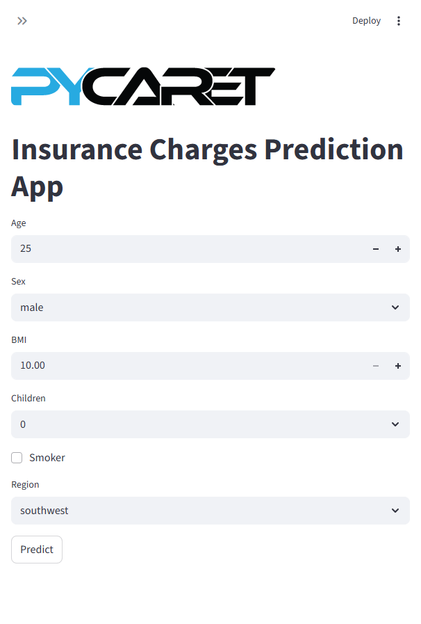

# 🏥 Insurance Charges Prediction App



> A beautiful Streamlit application for predicting patient insurance costs with PyCaret.

**Repository name:** `insurance-charges-prediction-app`

---

## 🚀 Run the App

### Option 1: Double-click
- Open `run_app.bat`
- The app launches automatically at `http://localhost:8501`

### Option 2: Command line
```bash
cd insurance_project_pycaret
streamlit run app.py
```

---

## 📌 GitHub Clone Instructions

Use this repository name for GitHub:

```bash
git clone https://github.com/<your-username>/insurance-charges-prediction-app.git
```

Then install dependencies:

```bash
cd insurance-charges-prediction-app/insurance_project_pycaret
pip install -r requirements.txt
```

---

## 🌟 What’s Included

- Modern Streamlit UI with a polished banner
- Online single-record prediction mode
- Batch CSV upload and download mode
- PyCaret regression model for fast inference
- Professional docs and screenshot support

---

## 📸 App Screenshot Preview


---

## 💡 Quick Features

- Single-record prediction with live metric display
- Batch scoring from CSV files
- Download results as CSV
- Clear sidebar navigation
- Elegant header and imagery

---

## 📋 Input Parameters

| Parameter | Type | Range | Example |
|-----------|------|-------|---------|
| Age | Integer | 18-100 | 35 |
| Sex | Dropdown | male/female | male |
| BMI | Float | 10.0-50.0 | 28.5 |
| Children | Integer | 0-10 | 2 |
| Smoker | Checkbox | yes/no | no |
| Region | Dropdown | southwest/southeast/northwest/northeast | northeast |

---

## 🧠 How to Use

### Online Mode
1. Run: `streamlit run app.py`
2. Choose **online** in the sidebar
3. Enter patient details
4. Click **Predict**
5. See estimated insurance cost instantly

### Batch Mode
1. Run: `streamlit run app.py`
2. Choose **batch** in the sidebar
3. Upload a CSV file
4. Click **Predict**
5. Download the prediction results

---

## 🔧 Installation

```bash
cd insurance_project_pycaret
pip install -r requirements.txt
```

---

## 🧪 Testing

```bash
cd insurance_project_pycaret
python test_app.py
```

---

## 📂 Project Structure

```
insurance-charges-prediction-app/
├── README.md
├── DOCUMENTATION_INDEX.md
├── PROJECT_REPORT.md
├── ARCHITECTURE.md
├── APP_PREVIEW.html
├── run_app.bat
├── assets/
│   ├── image.png
│   ├── image.jpeg
│   └── streamlit_screenshot.png
├── insurance_project_pycaret/
│   ├── app.py
│   ├── insurance.pkl
│   ├── requirements.txt
│   ├── README.md
│   └── test_app.py
└── insurance_charges.csv
```

---

## 🎯 Recommended GitHub Repository Name

`insurance-charges-prediction-app`

Use this name when creating the repo on GitHub and pushing your code.
